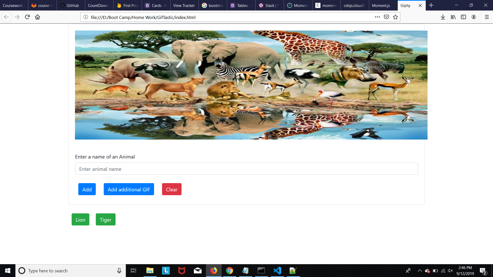

# GifStatic

## Site pictures


## Technologies Used
- HTML : used to create elements on the DOM
- Bootstrap  : Styles html elements on page
- Javascript : used to provide interative effects
- JQuery : event handling, DOM manipulation
- API : Used Gif API to grab some datas
- Git : version control system to track changes to source code
- GitHub : hosts repository that can be deployed to GitHub pages

## Summary
### This is an animal themed website. Click on pre-existing buttons to show GIF images of chosen animal. You can even add a new animal button and view GIFs. You can add additional Gif images in a row. User is provided with clear button to erase off GIF images. Also, you can even pause and play the GIF image when clicked.

## Code Snippet
```Javascript

    // *********************************************************
    // This code snippet allows user to pause and play gif images 
    // **********************************************************
        $(document).on("click",".animalGif",function(){
          var state = $(this).attr("data-state");
          // console.log("State :"+state+"of animal "+animals[i]);
          if(state === "still"){
            var animate = $(this).attr("data-animate");
            $(this).attr("src",animate);
            $(this).attr("data-state","animate");
          }
        
          if(state === "animate"){
            var still = $(this).attr("data-still");
            $(this).attr("src",still);
            $(this).attr("data-state","still");
          }
        });
```


## Author Links
[LinkedIn](https://www.linkedin.com/in/mahisha-gunasekaran-0a780a88/)

[GitHub](https://github.com/Mahi-Mani)

